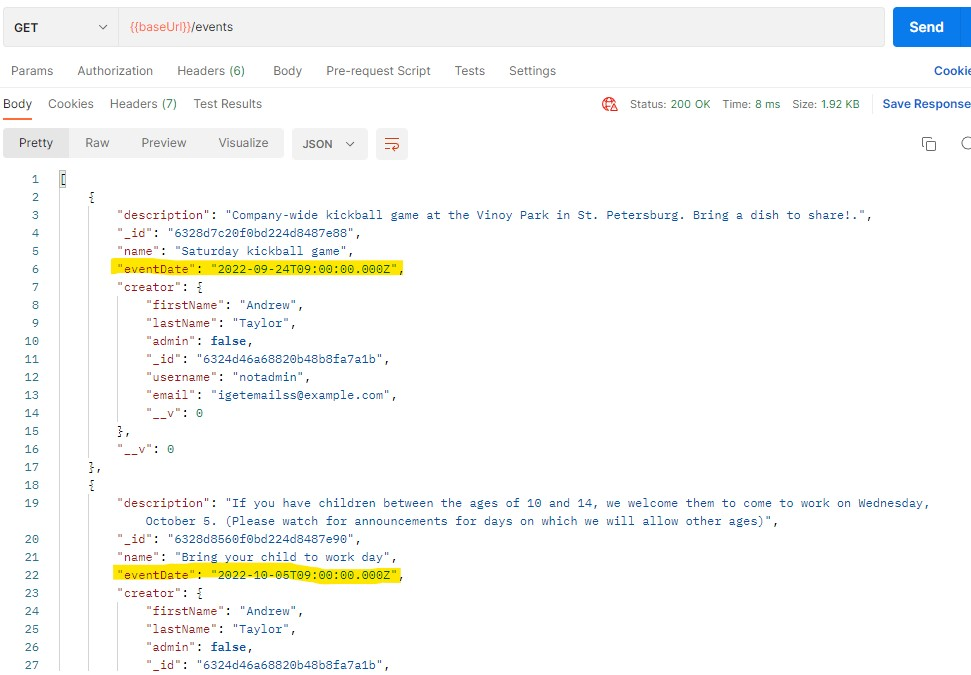
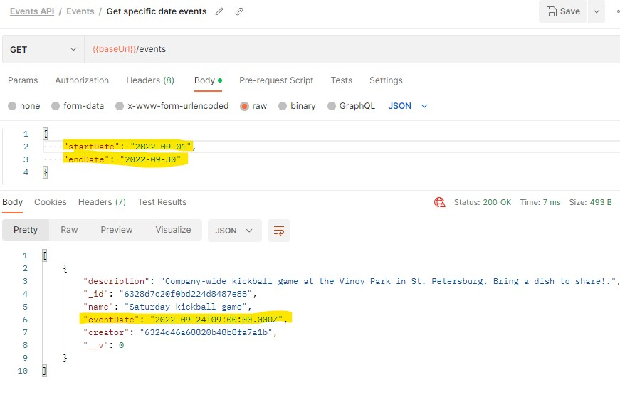
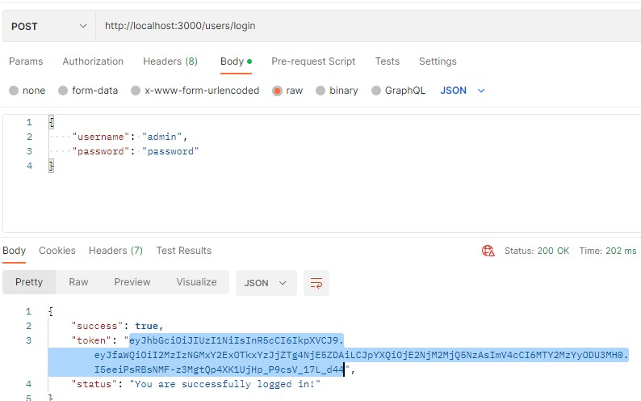
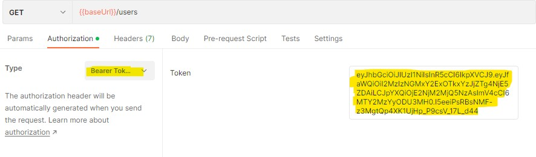
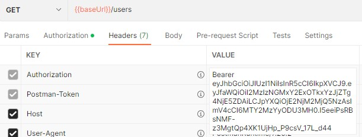

# This is the node/express server created as a side project during my Nucamp class.

The main goal of this website is to track events and users in MongoDB and set up endpoints for users to perform basic CRUD operations on this information.

Whether a user is logged in or not, they are able to perform GET requests to retrieve event information.

Any user set up as an "admin" can add, edit, or delete events, in addition to being able to view users.

Any user NOT set up as an admin will be able to create events and edit their own events, but nothing else.

This guide to my project is split into three main parts:
1. [Routes](#routes)
2. [Authentication](#authentication)
3. [Testing](#testing)

# <a name="routes">Routes</a>

## /users
GET: Will retrieve all users

DELETE: Will clear all users

PUT: Will not have any functionality at this endpoint

POST: Create a new user

## users/:userId

By adding the _id for the user in question to the url (i.e., https://localhost:3443/users/bigLongUser_IdHere), CRUD operations can be performed. All of these require a bearer token from an Admin.

GET: Retrieve information for specific user

DELETE: Delete a specific user

PUT: Will edit an existing user’s information

## /events
GET: Will retrieve all events from database. (Ignore the highlighted event times for now. Just note that all events are returned.)




If the body of the request has a startDate (in JSON format), all events for that day are returned.

If the body of the request has a startDate and endDate, all events on or between those dates will be returned.



DELETE: Clear all events from database
Requires bearer token from an Admin to be present.

POST: Create a new event
Requires a bearer token from a valid user. Does not require that user to be an admin.

The body must contain a name, description, and eventDate in JSON format. The eventDate must be a string that can be fed into <code>new Date(eventdate)</code> to create a valid javascript Date object.

## /events/:eventId
GET: Will retrieve information for the event with an _id of eventId

DELETE: Will delete a specific event

Requires a bearer token from either the creator of the event, or from an admin user.

PUT: Will edit an existing event

Requires a bearer token from either the creator of the event, or from an admin user.

# <a name='authentication'>Authentication</a>

When a user us successfully logged in, a token is returned.



This token can be copied and entered as a Bearer Token in the header (or automatically entered using Postman's "bearer" authentication method,) causing future requests to let the server know which user is making the request.

Here is an example of using the bearer token using Postman's bearer authentication



You can also add the header directly (this is all Postman was doing anyway). Make sure to add the header title "Authorization" with the value, "Bearer {token goes here}"


# <a name='testing'>Testing</a>

In order to test endpoints, you will need to have [MongoDB](https://www.mongodb.com/try/download/community) installed globally, and you will need a program to directly test the endpoints such as [Insomnia](https://insomnia.rest/download), or [Postman](https://www.postman.com/downloads/). I used postman, so any screenshots or instructions here will assume you have the same, but any program should work as long as you know how to perform the same steps (add bearer tokens, switch between HTTP methods, etc.)

You will also need openSSL installed in order to create a development example of a certified HTTPS connection.

## If you haven't already, run <code>npm install</code> to download dependencies.

## 1. Create a folder named "data"

## 2. In the /bin folder, create a development SSL key

Navigate a terminal to the /bin folder, and enter the following:

<code>openssl req -nodes -new -x509 -keyout server.key -out server.cert</code>

If you like you can answer the prompts, but since this is just for development don't stress about it. You can even just enter all answers blank.

## 3. Start the database

From the parent folder of "data", run the following:

<code>mongod --dbpath=data</code>

Leave this terminal running. 

## 4. Create users

Now we need two users to try out our endpoints--one who is an admin and one who is not.

There are multiple ways to go about this. In this guide, I recommend creating users with Postman, then manually altering one to be an admin.


Make sure the databse is currently connected to the "data" folder.

In a separate terminal, from the root folder (where you see package.json), run:

 <code>npm start</code>

## 5. Open postman, and send a POST request to https://localhost:3443/users with the following JSON body:

```
{
    "email": testemail1@example.com",
    "username": "notadmin",
    "password": "password",
    "firstName": "Joe",
    "lastName": "Schmoe"
}
```

**Before proceeding, make a note of the _id provided and note that it is not an admin.**

Now we need to create a (soon to be) admin (noting that the email and username MUST both be different.) Send another POST request with the following:

```
{
    "email": testemail2@example.com",
    "username": "admin",
    "password": "password",
    "firstName": "Linus",
    "lastName": "Torvalds"
}
```

**Make a note of the _id provided, noting that this will be the admin.**

Finally, since only admins can edit existing users using the API endpoints and we do not HAVE any admins yet, we have to manually alter one to be an admin.

In a separate terminal, run <code>mongo</code>

In the mongo CLI, enter <code></code>
